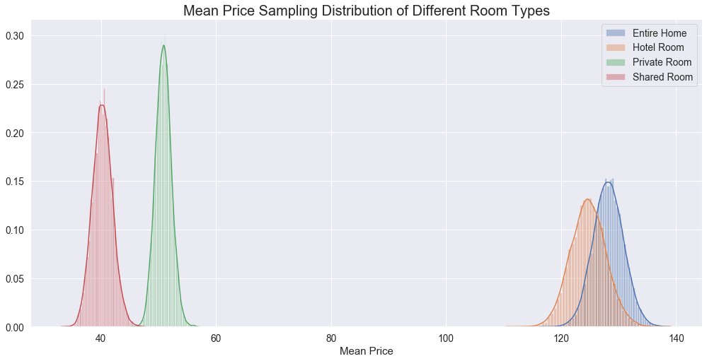
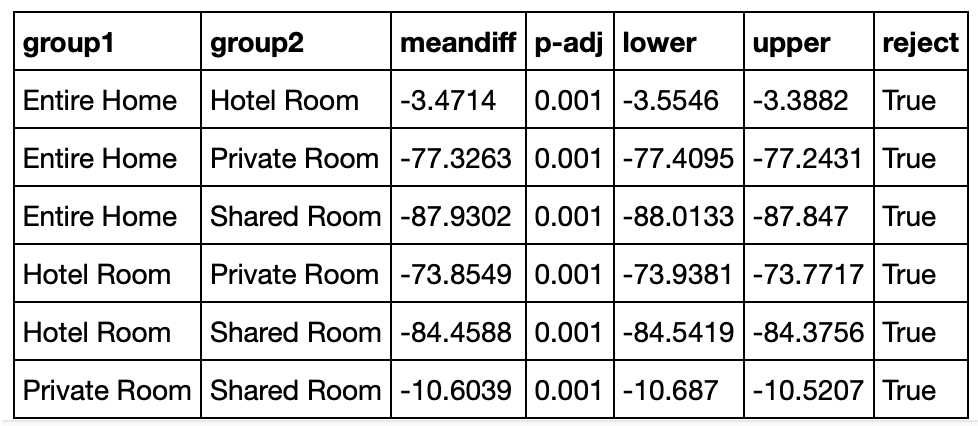
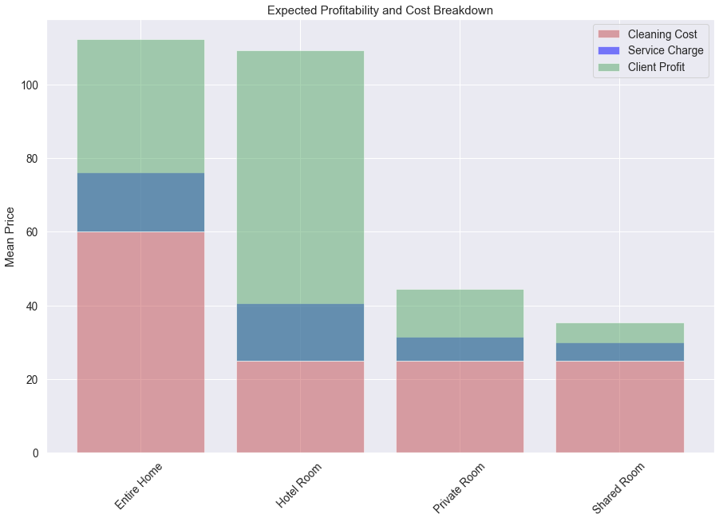
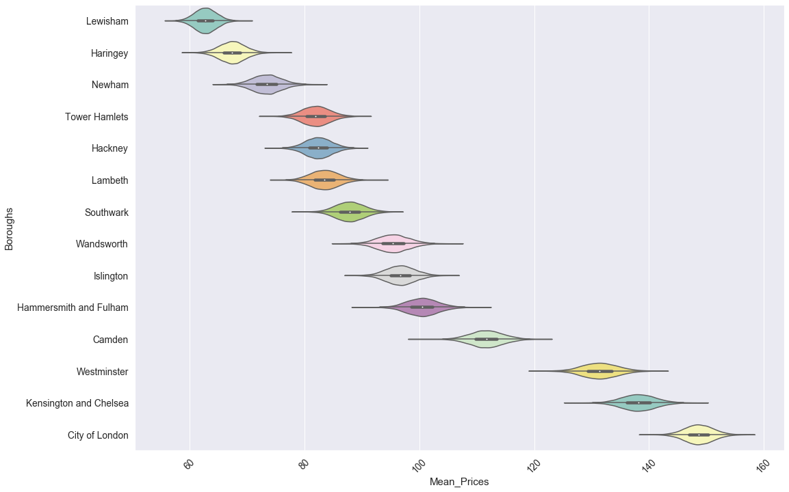
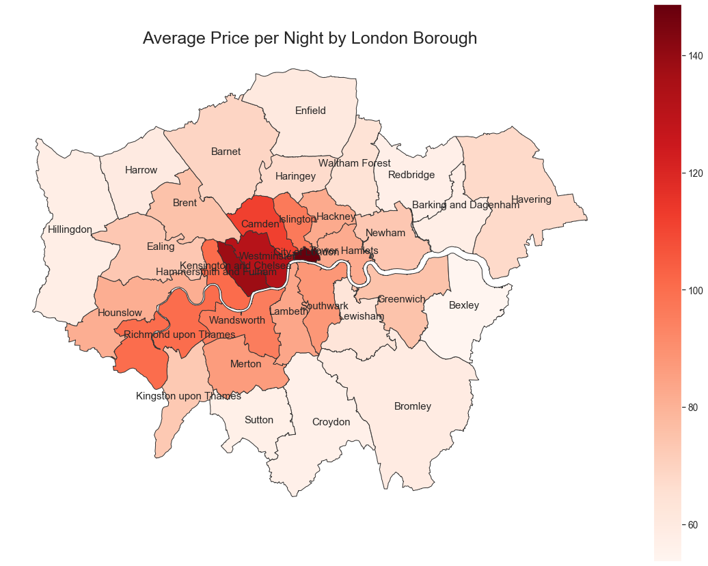

# Module 3: London Airbnb 2019 Listings Analysis

## Context
Since 2008, guests and hosts have used Airbnb to expand on traveling possibilities and present more unique, personalized way of experiencing the world. As such, the platform has experienced a surge of property listing which eventually led to emergence of hospitality management companies specializing in managing the end-to-end process of listing an AirBnB property including keys management, professional cleaning, marketing and pricing. Some of the London based companies include:

To set the context, we are an independent rental consultancy firm hired by one of the companies above that wishes to extend their presence in the London market. The purpose of this project to help our client in choosing the right market in London (in terms of property type and the location), followed by providing some valuable insights onto how they can increase traffic onto their advertised properties (length of description title and number of reviews).

## Acknowledgements & Data Source
The London airbnb listings dataset is part of Airbnb, and the original source can be found on this [website](http://insideairbnb.com/). This dataset describes the listing activity and metrics in London, UK for 2019 (except 2019.12).

## Code Background:
The key deliverables in this project can be found in the 'london_airbnb.ipynb' notebook alongside the Keynote slide. All of the python functions can be found seperately within the 'shuyu-finn.py' file in the 'external_modules' folder

## Summary:
To start off, we have decided to narrow down the target market for our client by running two initial hypothesis test:
    - Are there any significant price differences between room types?
    - Are there significant price differences between London neighbourhoods?
 
Once we established the target market, we will further explore steps to increase our client's conversionr rate:
    - Is there a statistical significance between number of reviews and price?if so at which levels
    - Is there a statistical significance between length of titles and number of reviews? if so at which levels

### 1. Are there any significant price difference between room types?

Now, visually we can see some statistically differences in price between private and shared rooms. However, we can't tell if this is also the case for hotel rooms and entire homes.

Logically speaking, we would expect price of entire home > hotel > private > shared rooms. That being said, we need to statistically test this using an ANOVA test followed by a Tukey's test. 

Before setting our test, we need to set the null and hypothesis statements alongside the alpha value.

H-null: Mean price of entire homes = Mean price of hotel rooms
H-alt: Mean price of entire homes > Mean price of hotel rooms
alpha = 0.05

As per above, we can reject our null hypothesis.  

There is statistically significant difference between prices of room type. To achieve better profitability for both client and its final benefactor, we suggest focusing more on entire homes, followed by private rooms.

### 2. Are there significant price differences between London neighbourhoods?

According to the plots above, we can see there are clear price differences between majority of the boroughs. Running an ANOVA test followed by Tukey's can confirm this.

Given majority of costs for our client are fixed regardless of borough, it would be wise to narrow down the target market to inner London boroughs, as depicted above

### 3. Is there a statistical significance between number of reviews and price? 

